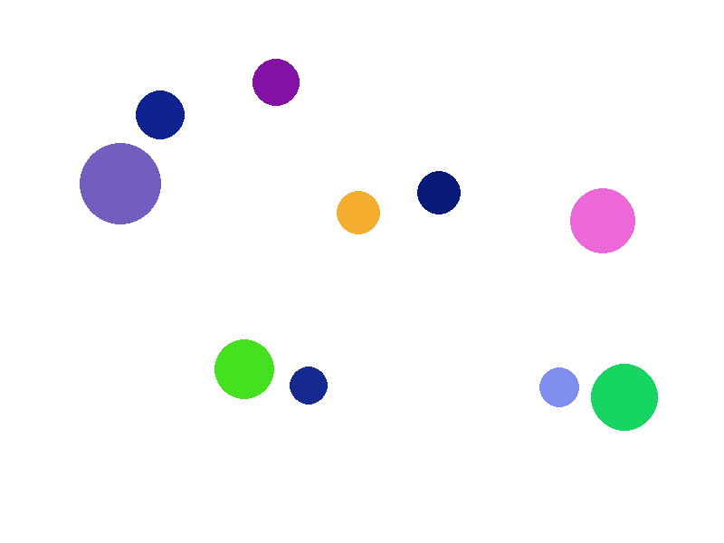

# Simulation

This is a simulation program that simulates the motion and collision of balls within a window.

## Features

- Simulates the motion and collision of multiple balls.
- Handles boundary collisions to prevent balls from going off-screen.
- Supports gravity and friction for realistic ball behavior.
- Provides a screenshot feature to capture the current state of the simulation.
- Allows the user to quit the application.

## Requirements

- Python 3.x
- Pygame library

## Installation

- Install the required dependencies:

    python3 -m pip install pygame

## Usage

- Navigate to the project directory:

    cd src

- Run the simulation:

    python3 simulation.py

- Use the following keys to interact with the simulation:
    
    A: Add Ball
    D: Remove Ball
    R: Reset
    G: Gravity on/off
    M: Sounds on/off
    S: Capture a screenshot of the current simulation and save it as a PNG file.
    Q: Quit the application.

## Customization

You can customize the simulation by modifying the configuration parameters in the config.py file. Adjust the number of balls, window dimensions, friction, etc., according to your preferences.
License

This project is licensed under the MIT License. See the LICENSE file for details.